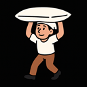

<div align="center">
  
</div>

# Nombre del Proyecto

> Breve descripcion del proyecto (1-2 lineas).

---

## Stack Tecnologico

| Capa | Tecnologia |
|------|------------|
| **Lenguaje** | C# / Python / etc. |
| **Runtime** | .NET 8 / Node.js / etc. |
| **Base de datos** | SQL Server |

---

## Requisitos

- [ ] Requisito 1
- [ ] Requisito 2

---

## Instalacion y Ejecucion

### 1. Clonar el repositorio

```bash
git clone https://github.com/ORGANIZACION/NOMBRE-REPO.git
cd NOMBRE-REPO
```

### 2. Configurar hooks de Git

```bash
# Windows: doble click en setup.bat
# O manualmente:
git config core.hooksPath .githooks
```

### 3. Configurar OpenProject

Editar `.openproject.conf` y poner el `PROJECT_ID` correspondiente:

```
PROJECT_ID=9    # Cambiar segun proyecto
TYPE_ID=10      # Tipo de tarea (10 = CAMBIO)
```

IDs de proyectos disponibles:

| ID | Proyecto |
|----|----------|
| 16 | DESPACHO EN LINEA |
| 15 | ETIQUETADO PRODUCTO EN PROCESO |
| 14 | GESTION HUMANA |
| 13 | GENERACION IPT |
| 12 | DESBLOQUEO DE ORDENES |
| 11 | KARDEX |
| 10 | Procesos Disciplinarios |
| 9  | ALISTAMIENTO |
| 8  | Daily Sistemas |

### 4. Configurar API Key de OpenProject

```powershell
[Environment]::SetEnvironmentVariable("OPENPROJECT_API_KEY","TU_API_KEY","User")
```

> Reiniciar la terminal despues de configurar la variable.

### 5. Ejecutar el proyecto

```bash
# Completar segun tipo de proyecto
```

---

## Estructura del Proyecto

```
NOMBRE-REPO/
├── Assets/             Logo e iconos
├── .githooks/          Hooks de Git (post-commit → OpenProject)
├── .openproject.conf   Configuracion del proyecto en OpenProject
├── setup.bat           Script de configuracion inicial
└── README.md
```

---

## Desarrollo Asistido por IA

Este proyecto utiliza **Claude Code** (Anthropic) como agente de IA para asistir en el desarrollo. Si el repositorio incluye archivos `CLAUDE.md`, estos contienen reglas de codigo, patrones y restricciones que el agente respeta automaticamente.

---

## Licencia

Software propietario de **Integral de Empaques S.A.S.** — Uso interno exclusivo.
